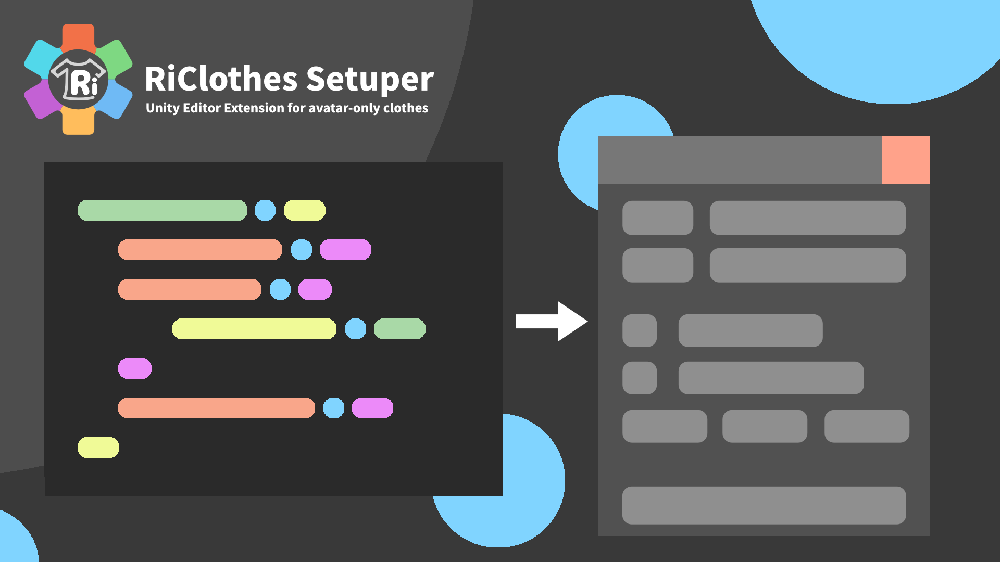

# RiClothesSetuper
アバター専用服向け着替えUnity Editor拡張

## 機能
* 服側に設定ファイルを置くことで、独自のオプションを追加することができます  
例  
  * 不要な部分の削除
    * アバターがデフォルトで来ている服を削除するなど  
  * 帽子などのパーツの差分設定
    * 左につけるか右につけるかなど

* 言語ファイルを用意することで多言語に対応することができます (システムのテキストは日本語と英語に対応しています)

* 分けられたPNGファイルから差分を生成することができます

* Missing Removerを統合しているので、Dynamic Bone未所持 / 未導入 の環境に対応しています

* 一応アバターのボーンに同じ名前のボーンを入れるタイプの専用服はRiClothes Setuperに対応していなくても導入できるように作っています  

## ドキュメント
まだ書けてない...

## 更新履歴
* 2.0.0
  * 書き直しました
  * PathInfoのコンポーネントは廃止されました  
    * あとからRiClothes Setuperをインポートした時に正常に動作しないため
  * OptionPathの実装
    * 外部ファイルに書くことであとからRiClothes Setuperを導入しても正常に動作するようになりました
    * 複数のファイル名がサポートされます (詳しくはドキュメントで)
  * 相対パスのサポート (Assetsからの絶対パスの廃止)
    * V1では絶対パスしか指定できませんでしたが、V2からは相対パスになりました (Assetsからの絶対パスは使用できません)
    * そのパスを指定する場所によってベースパスはそれぞれ異なります (OptionPath, Setuper, など...)
    * '../'で一つ前のディレクトリに戻ることができます
    * これにより親フォルダの位置が変わったり、名前が変わったりしても正常に動作するようになります
  * Setuper関連
    * アバターのボーンに同じ名前の服のボーンを入れるタイプの服をサポートしました (服側がRiClothes Setuperに対応している必要がありません)
    * オプションに説明を追加しました
    * 削除コマンドの処理が変わりました
      * オブジェクトが削除されなくなり、タグをEditorOnlyに設定し、非アクティブにするようになりました
      * これによりアバターを元の状態に戻せるようになります
    
    * 詳細オプションの実装
      * Missing Removerの動作設定
      * 削除コマンドの動作設定
  * ExpandOption V2の実装
    * version: 2
    * 削除 / 変更 された要素
      * unnecessary_objects (不要なオブジェクト) が削除されました
        * V2以上は服側が独自にそのオプションを実装してください
      * original_bonesが削除されました
        * 代わりに服のオブジェクトをアバターに移動させる MOVE_OBJECT を実装しました
      * DiffTexを別のファイルに書くようになりました
      * operationが廃止され、全てoperation_listに書くようになりました
    * 追加された要素
      * オプションに説明をつけれるようになりました
        * '\n'で改行できます
      * exclude_object_listを追加しました
        * このリストに書かれたオブジェクトはSetuper側で処理されなくなります
        * アバター側に独自ボーンがある場合などに便利です
      * before_move_boneを追加しました
        * 服のボーンが移動される前にオプションが処理されます
      * after_move_boneを追加しました
        * 服のボーンが移動された後にオプションが処理されます
  * DiffTex V2の実装
    * base_pathを追加
      * 出力パスのベースパスを指定できます
      * ベースパスはそのJSONファイルがあるフォルダです
    * レイアウトを調整し、見やすくなりました
    * テクスチャ、パーツに説明を追加できるようになりました
      * \nで改行できます
  * Cloth Uninstallerの実装
    * アバターに着せたExpand Option V2以上に対応している服をアンインストールすることができます
    * 服側で追加されたオブジェクト(ボーン, 服など)が削除されます
      * その服のIDが名前に含まれていたら削除
    * 非アクティブになっているオブジェクトをアクティブにします
    * EditorOnlyのタグになっているオブジェクトをUntaggedにします
    * 着せ替え後に何かしらの改変などをすると正常に動作しない可能性があります
* 1.0.1
  * original_boneでボーンの名前が変更されないバグを修正
* v1.0.0
  * Expand Option Version: 1
  * DiffTexVersion 1
  * 初リリース